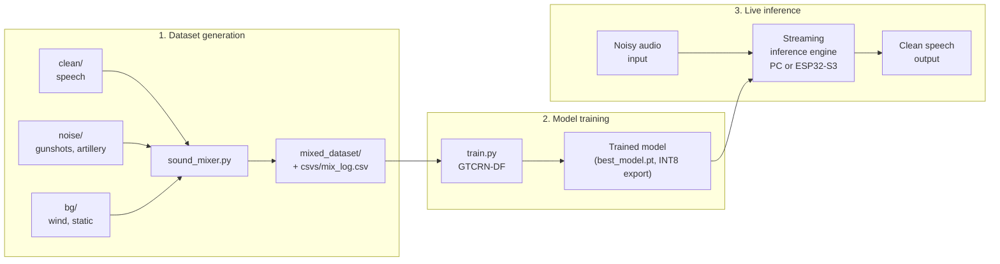
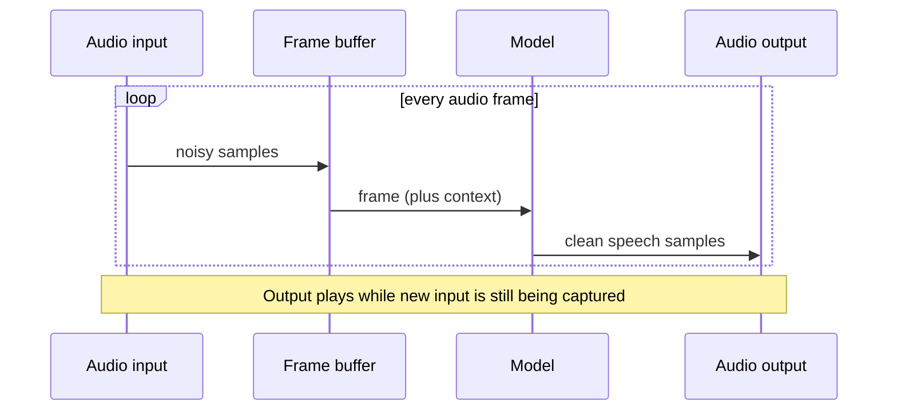
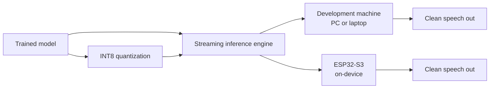
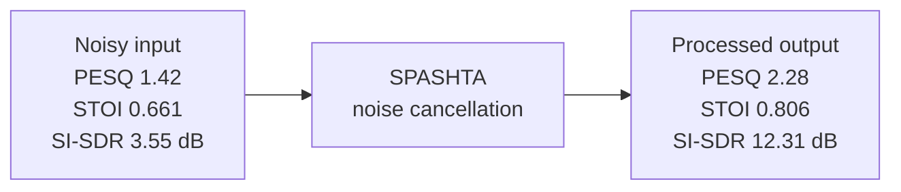
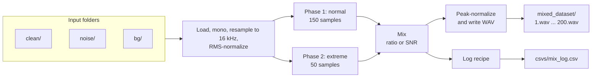
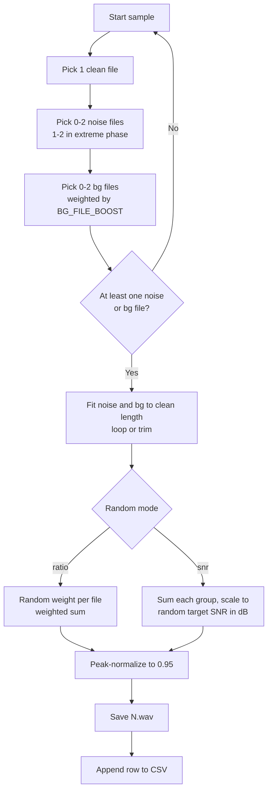
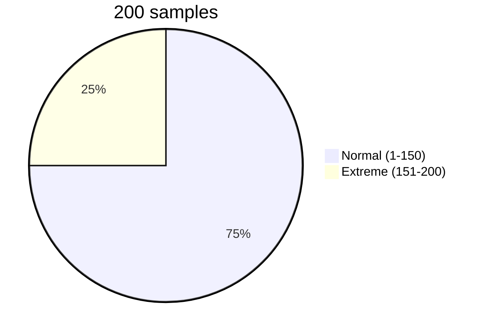

<h1 align="center">SPASHTA</h1>

<p align="center"><b>Adaptive Noise Cancellation for Impulsive Defence Noise</b></p>

An AI-driven system that suppresses impulsive and dynamic battlefield noise (gunshots, artillery, vehicle and wind noise) and delivers **clean, intelligible speech in real time**. The project has **Live inference**, a streaming engine that takes noisy audio as it is captured, suppresses impulsive noise, and outputs clean speech simultaneously. It runs on a standard computer and can also run on embedded hardware (ESP32-S3 class).


**Design goal:** Preserve speech, suppress selectively, reconstruct when possible.

---

## Table of Contents

1. [System architecture](#system-architecture)
2. [Model training](#model-training)
3. [Live inference](#live-inference)
   - [Embedded deployment](#embedded-deployment)
   - [Performance results](#performance-results)
4. [Dataset generation](#dataset-generation)
5. [Repository layout](#repository-layout)
6. [Quick start](#quick-start)
7. [Mixing modes](#mixing-modes)
8. [Normal vs. extreme phases](#normal-vs-extreme-phases)
9. [Configuration reference](#configuration-reference)
10. [Output format](#output-format)
11. [Boosting specific files](#boosting-specific-files)
12. [Troubleshooting](#troubleshooting)
13. [Known limitations](#known-limitations)
14. [Roadmap](#roadmap)
15. [References](#references)

---

## System architecture



| Stage | Input | Output | Status in this README |
|---|---|---|---|
| Dataset generation | Clean speech, noise, background clips | Mixed WAVs + CSV recipe log | Fully documented below |
| Model training | `mixed_dataset/` + `mix_log.csv` | Trained model (`best_model.pt`) and INT8 blob for the ESP32-S3 | Documented in [Model training](#model-training) |
| Live inference | Live noisy audio + trained model | Clean speech, simultaneously | Documented in [Live inference](#live-inference) |

---

## Model training

SPASHTA uses a **causal GTCRN-DF** model: a GTCRN core (grouped temporal convolutional recurrent network) with a low-band DeepFilter stage, and frequency-aware attention (BandTRA) inside the recurrent bottleneck. It is causal, so it uses only past frames and never future ones.


| Item | Value |
|---|---|
| Model | Causal GTCRN-DF (`model.py`) |
| Parameters | About 140K trainable parameters (comparable in size to RNNoise) |
| Input representation | STFT at 16 kHz, FFT 512, hop 256, 32 channels |
| Encoder / decoder | 5 GTConv blocks each, using grouped and depthwise operations for edge deployment |
| Bottleneck | 3 DPGRNN stages (dual-path grouped RNN) with band-wise TRA (BandTRA) |
| Output stage | Bounded complex mask plus a 5-tap deep filter on the low band |
| Optimizer | AdamW with warmup and cosine decay |
| Training tricks | EMA weights, mixed precision (FP16 / BF16), activity-weighted losses |
| Objective | Speech-gain loss plus asymmetric suppression losses, so the model is penalized for suppressing speech-dominant regions ("turn everything down") |
| Robustness | Extreme-phase training mixtures and an extreme held-out set down to -5 dB SNR |
| Stack | Python, PyTorch, TorchAudio, NumPy, SciPy, SoundFile, Einops |

**Why BandTRA:** a single broadband gating decision treats all frequency bins the same. BandTRA gives different temporal gains to different frequency bands, so a gunshot transient can be attenuated in the bands it dominates without damaging speech elsewhere.

```bash
python train.py --data_root sample_data --epochs 120
```

Checkpoints are written under `trained_models/` (for example `trained_models/model_high/best_model.pt`). The `difficulty` column in `csvs/mix_log.csv` can be used to stratify train and validation splits.

---

## Live inference

The inference engine processes audio as a stream: incoming noisy audio is suppressed of impulsive noise (gunshots, artillery) and background noise, and clean speech is output at the same time, rather than after the recording ends.

### Streaming flow



### What the engine handles

| Noise type | Character | Why it is hard |
|---|---|---|
| Gunshots, artillery | Impulsive, very short, very loud | Almost no signal to work with during the transient |
| Wind, static | Continuous, broadband | Overlaps speech across the spectrum |
| Vehicle and engine noise | Quasi-stationary | Can shift over time |
| Combinations | Several of the above at once | Training data deliberately mixes them (see below) |

### Inference details

| Item | Value |
|---|---|
| Model architecture | Causal GTCRN-DF: ERB filterbank, 5-block GTConv encoder and decoder, 3-stage DPGRNN bottleneck with BandTRA, bounded complex mask plus 5-tap low-band DeepFilter (about 140K parameters) |
| Framework and runtime | PyTorch (FP32 / checkpoint inference on PC); INT8-quantized model blob running in an ESP-IDF runtime on the ESP32-S3 |
| Sample rate | 16 kHz (matches the training data generated below) |
| Frame or hop size | FFT 512 samples (32 ms window), hop 256 samples (16 ms) |
| End-to-end latency | 32 ms documented algorithmic latency (one STFT frame). Measured on-device latency is still to be benchmarked (see [Roadmap](#roadmap)) |
| Target hardware | Standard computers (CPU) and ESP32-S3-class embedded devices; runs on CPU/DSP, no GPU needed |
| Input and output devices | Microphone or headset input and headphone or speaker output; the demo rig pairs the ESP32-S3 board with a small LCD that shows the "Live Inferencing" status |
| Entry point / command | `python infer.py --checkpoint trained_models/model_high/best_model.pt --input <noisy.wav> --output <clean.wav>` on PC; ESP-IDF firmware on the ESP32-S3 |

---

## Embedded deployment

The same trained model and streaming engine can run on embedded hardware as well as on a standard computer, so noise suppression can happen on-device, at the point where the audio is captured. There is no cloud dependency: the enhancement stage runs entirely locally.



| Constraint | Why it matters on embedded hardware | Value |
|---|---|---|
| Compute (CPU, NPU or DSP) | Sets how large a model can run in real time | ESP32-S3 CPU/DSP; causal, mask-based model, no on-device GPU needed |
| Memory footprint | Model weights and audio buffers must fit in RAM | About 140K parameters, roughly 140 KB of weights at INT8 (1 byte per parameter). Activation and buffer memory on the board is still to be profiled |
| Model size and precision | Smaller or quantized models are usually needed | About 140K parameters, INT8-quantized, using grouped and depthwise operations |
| Latency budget | Live speech needs low end-to-end delay | 32 ms algorithmic latency (one STFT frame); on-device timing still to be benchmarked |
| Power and thermal limits | Matters for battery-powered or sealed devices | Small-footprint model suited to battery-powered radios and wearables; power draw not yet measured |
| Audio interface | Microphone and headset input and output on the device | Microphone or headset in, headphone or speaker out, 16 kHz mono |
| Runtime and toolchain | How the model is exported and executed on the board | Train in PyTorch, quantize to an INT8 blob, run in an ESP-IDF ESP32-S3 runtime |

**Intended uses:** tactical communications headsets, embedded radios, wearable communication devices, and engine- or machinery-heavy vehicle communications.

Embedded microphones and codecs sound different from digital mixes, so validate performance on the device itself, not only on the generated dataset.

---

## Performance results

Objective quality and intelligibility metrics, averaged over the full evaluation set of **240 files**, comparing the noisy input against the processed (denoised) output.



| Metric | Noisy input | Processed output | Gain | Relative change |
|---|---|---|---|---|
| PESQ | 1.42 | 2.28 | **+0.86** | +61% |
| STOI | 0.661 | 0.806 | **+0.145** | +22% |
| SI-SDR (dB) | 3.55 | 12.31 | **+8.76** | n/a (already in dB) |

A positive gain means an improvement over the noisy input. All three metrics improved.

### What the metrics measure

| Metric | Measures | Scale | Better is |
|---|---|---|---|
| PESQ | Perceptual speech quality, predicting listener opinion scores | Roughly 1 to 4.5 | Higher |
| STOI | Short-time speech intelligibility | 0 to 1 | Higher |
| SI-SDR | Signal fidelity relative to the clean reference, insensitive to scale | dB, unbounded | Higher |

> These are dataset-wide means, so they do not show how results vary between files, between `normal` and `extreme` conditions, or across noise types. A per-difficulty and per-noise-type breakdown would show where the model is strongest and weakest.

---

## Dataset generation

`sound_mixer.py` scans three folders of source audio, mixes them into hundreds of varied samples, and logs the exact recipe of every sample to a CSV. It is what produces the noisy/clean conditions the model is trained on.

### Features

- **Folder-driven**: drop any number of files into `clean/`, `noise/` and `bg/`; nothing is hardcoded.
- **Variable composition**: every sample uses exactly one clean file, plus a random number (0 to 2) of noise files and background files.
- **Two mixing modes**, chosen randomly per sample: random amplitude ratios, or target SNR in dB.
- **Two difficulty phases**: `normal` samples keep speech clearly audible; `extreme` samples push noise up to stress-test the model, with a floor of roughly -5 dB.
- **Loudness-safe**: every clip is RMS-normalized on load, so a loud gunshot cannot silently bury speech.
- **Weighted file selection**: make chosen files (for example `static.wav`) appear more often.
- **Full traceability**: a CSV records every source file and every weight or SNR used.
- **Reproducible**: seeded random generator.

### Pipeline



### Per-sample generation



### Dataset composition (defaults)



---

## Repository layout

```text
project/
├── sound_mixer.py        # dataset generator
├── model.py              # GTCRN-DF model (ERB filterbank, DPGRNN + BandTRA, DeepFilter)
├── train.py              # training script (AdamW, EMA, mixed precision)
├── infer.py              # inference entry point (checkpoint -> clean audio)
├── clean/                # INPUT  - clean speech recordings
├── noise/                # INPUT  - impulsive/transient noise (gunshots, artillery, ...)
├── bg/                   # INPUT  - continuous background (wind, static, engine hum, ...)
├── mixed_dataset/        # OUTPUT - 1.wav, 2.wav, ... (created automatically)
├── csvs/
│   └── mix_log.csv       # OUTPUT - one row per generated sample (created automatically)
├── sample_data/          # training data root passed to train.py
├── trained_models/
│   └── model_high/
│       └── best_model.pt # trained checkpoint
└── examples/
    └── extreme/          # noisy.wav, clean.wav, spectrogram_comparison.png
```

| Folder | Role | Examples | Required |
|---|---|---|---|
| `clean/` | Speech source, exactly one per sample | Speech recordings | Yes |
| `noise/` | Transient interference | Gunshots, artillery | No (sample can use bg only) |
| `bg/` | Continuous interference | Wind, `static.wav` | No (sample can use noise only) |
| `mixed_dataset/` | Generated audio | `1.wav` to `200.wav` | Auto-created |
| `csvs/` | Generation log | `mix_log.csv` | Auto-created |
| `trained_models/` | Model checkpoints | `model_high/best_model.pt` | Created by training |
| `examples/` | Demo audio and spectrograms | `noisy.wav`, `clean.wav` | Optional |

Supported input formats: `.wav`, `.flac`, `.ogg`, `.mp3` (MP3 needs a `libsndfile` build with MP3 support; WAV is safest).

---

## Quick start

### Generate the dataset

```bash
pip install numpy soundfile
python sound_mixer.py
```

Add your audio to `clean/`, `noise/` and `bg/` first. Results land in `mixed_dataset/` (audio) and `csvs/mix_log.csv` (log).

```text
Found 3 clean, 2 noise, 3 bg file(s)
  [normal] generated 10/150
  ...
  [extreme] generated 50/50

Done. Generated 200 files in 'mixed_dataset/'
Log written to 'csvs/mix_log.csv'
```

### Train the model

```bash
python train.py --data_root sample_data --epochs 120
```

### Run inference

```bash
python infer.py --checkpoint trained_models/model_high/best_model.pt --input examples/extreme/noisy.wav --output examples/extreme/clean.wav
```

For live, on-device use, the INT8 model blob is integrated into an ESP-IDF runtime for the ESP32-S3 (see [Embedded deployment](#embedded-deployment)).

---

## Mixing modes

Each sample randomly uses one of two modes (`MODE_WEIGHTS`, 50/50 by default).

| | `ratio` mode | `snr` mode |
|---|---|---|
| **Idea** | Each selected file gets its own random amplitude weight | Noise and bg groups are scaled to a target SNR relative to the speech |
| **Control** | Relative loudness by weight | Loudness in dB |
| **Multiple noise files** | Each weighted independently, then summed | Summed into one composite, then scaled as a group |
| **Logged value** | Per-file weights | One SNR (dB) per group |
| **Best for** | Quick, intuitive variety | Standard speech-enhancement style conditioning |

**SNR scaling** used in `snr` mode:

```text
target_noise_rms = clean_rms / 10^(SNR_dB / 20)
noise_scaled     = noise * (target_noise_rms / noise_rms)
```

| SNR (dB) | Meaning |
|---|---|
| +20 | Speech far louder than noise (easy) |
| 0 | Speech and noise equally loud |
| -5 | Noise about 1.8x louder than speech (the extreme-phase floor) |

In both modes the final mix is peak-normalized to 0.95 to prevent clipping.

---

## Normal vs. extreme phases

| Setting | Normal (samples 1-150) | Extreme (samples 151-200) |
|---|---|---|
| Purpose | Speech clearly audible | Robustness training |
| Noise files per sample | 0 to 2 | 1 to 2 (always present) |
| Bg files per sample | 0 to 2 | 0 to 2 |
| Ratio weights: clean | 0.7 to 1.0 | 0.6 to 0.85 |
| Ratio weights: noise | 0.2 to 0.6 | 0.35 to 0.55 |
| Ratio weights: bg | 0.15 to 0.5 | 0.3 to 0.5 |
| SNR range: noise | 0 to 20 dB | -5 to 5 dB |
| SNR range: bg | 0 to 20 dB | -5 to 8 dB |
| CSV `difficulty` value | `normal` | `extreme` |

The `difficulty` column makes it easy to filter or stratify the dataset when splitting into train and validation sets.

---

## Configuration reference

All settings live in the `CONFIG` block at the top of `sound_mixer.py`.

### General

| Parameter | Default | Description |
|---|---|---|
| `CLEAN_DIR`, `NOISE_DIR`, `BG_DIR` | `clean`, `noise`, `bg` | Input folders |
| `OUTPUT_DIR` | `mixed_dataset` | Where mixed WAVs are written |
| `CSV_DIR` | `csvs` | Where the log is written |
| `TARGET_SR` | `16000` | Sample rate all audio is converted to |
| `AUDIO_EXTS` | `.wav .flac .mp3 .ogg` | File types scanned |
| `NUM_NORMAL_SAMPLES` | `150` | Samples in the normal phase |
| `NUM_EXTREME_SAMPLES` | `50` | Samples in the extreme phase |
| `RANDOM_SEED` | `42` | Seed for reproducibility |
| `TARGET_INPUT_RMS` | `0.1` | Loudness every source clip is normalized to on load |
| `REQUIRE_AT_LEAST_ONE_NOISE_OR_BG` | `True` | Prevents pure-clean samples |
| `MODE_WEIGHTS` | `ratio 0.5, snr 0.5` | Probability of each mixing mode |

### Files per sample

| Parameter | Default | Description |
|---|---|---|
| `CLEAN_COUNT_RANGE` | `(1, 1)` | Always exactly one clean file |
| `NOISE_COUNT_RANGE` | `(0, 2)` | Noise files, normal phase |
| `BG_COUNT_RANGE` | `(0, 2)` | Bg files, normal phase |
| `NOISE_COUNT_RANGE_EXTREME` | `(1, 2)` | Noise files, extreme phase |
| `BG_COUNT_RANGE_EXTREME` | `(0, 2)` | Bg files, extreme phase |

### Loudness ranges

| Parameter | Default |
|---|---|
| `CLEAN_WEIGHT_RANGE` / `NOISE_WEIGHT_RANGE` / `BG_WEIGHT_RANGE` | `(0.7, 1.0)` / `(0.2, 0.6)` / `(0.15, 0.5)` |
| `CLEAN_WEIGHT_RANGE_EXTREME` / `NOISE_WEIGHT_RANGE_EXTREME` / `BG_WEIGHT_RANGE_EXTREME` | `(0.6, 0.85)` / `(0.35, 0.55)` / `(0.3, 0.5)` |
| `NOISE_SNR_RANGE_DB` / `BG_SNR_RANGE_DB` | `(0, 20)` / `(0, 20)` |
| `NOISE_SNR_RANGE_DB_EXTREME` / `BG_SNR_RANGE_DB_EXTREME` | `(-5, 5)` / `(-5, 8)` |

### File boosting

| Parameter | Default | Description |
|---|---|---|
| `BG_FILE_BOOST` | `{"static.wav": 4.0}` | Sampling-weight multipliers for bg files |
| `NOISE_FILE_BOOST` | `{}` | Same, for noise files |
| `CLEAN_FILE_BOOST` | `{}` | Same, for clean files |

---

## Output format

### Audio

`mixed_dataset/<N>.wav`, 16 kHz, mono, numbered sequentially. Each file is as long as its clean speech clip; noise and bg clips are looped or trimmed to match.

### CSV schema (`csvs/mix_log.csv`)

| Column | Description |
|---|---|
| `filename` | Output file, for example `42.wav` |
| `difficulty` | `normal` or `extreme` |
| `mode` | `ratio` or `snr` |
| `num_clean` | Number of clean files used (always 1) |
| `num_noise` | Number of noise files used |
| `num_bg` | Number of bg files used |
| `clean_files` | Clean source filename |
| `noise_files` | Noise source filenames, `;`-separated |
| `bg_files` | Bg source filenames, `;`-separated |
| `clean_weights` | Clean amplitude weight (`ratio` mode only, blank in `snr` mode) |
| `noise_weights_or_snr_db` | Per-file weights in `ratio` mode, or the group SNR in dB in `snr` mode |
| `bg_weights_or_snr_db` | Same, for bg |
| `duration_sec` | Length of the output in seconds |

> The `noise_weights_or_snr_db` and `bg_weights_or_snr_db` columns change meaning with `mode`. Always read them together with the `mode` column.

### Illustrative rows

```csv
filename,difficulty,mode,num_clean,num_noise,num_bg,clean_files,noise_files,bg_files,clean_weights,noise_weights_or_snr_db,bg_weights_or_snr_db,duration_sec
12.wav,normal,ratio,1,2,1,speech_1.wav,gun_2.wav;gun_1.wav,static.wav,0.812,0.418;0.355,0.274,2.0
87.wav,normal,snr,1,1,2,speech_3.wav,gun_1.wav,static.wav;wind_1.wav,,12.4,6.85;6.85,2.0
173.wav,extreme,snr,1,2,1,speech_2.wav,gun_1.wav;gun_2.wav,static.wav,,-3.9;-3.9,-1.2,2.0
```

---

## Boosting specific files

`BG_FILE_BOOST` multiplies a file's chance of being picked. With `{"static.wav": 4.0}` and two other bg files at weight 1.0, `static.wav` has a `4 / (4 + 1 + 1)` = 67% chance of being the first bg file drawn, versus 17% for each of the others.

| Files in `bg/` | Weights | Chance of first pick |
|---|---|---|
| `static.wav` | 4.0 | 67% |
| `wind_1.wav` | 1.0 | 17% |
| `wind_2.wav` | 1.0 | 17% |

Matching is case-insensitive on the filename. Selection within a sample is without replacement, so a single sample never uses the same file twice. The generator is seeded (`RANDOM_SEED = 42`), so identical inputs and settings reproduce the same dataset.

---

## Troubleshooting

| Symptom | Likely cause | Fix |
|---|---|---|
| `No clean speech files found` | `clean/` is missing, empty, or has unsupported formats | Check the path and file extensions |
| Fewer than 200 files generated | Constraints could not be met (for example both noise and bg folders empty) | Add noise or bg files, or relax the count ranges |
| Speech barely audible in some samples | Weights or SNR ranges too aggressive | Raise the clean weight floor or the SNR floors |
| Extreme samples too harsh | Extreme SNR and weight ranges too low | Raise the lower bounds of the extreme SNR ranges |
| MP3 fails to load | `libsndfile` build without MP3 support | Convert to WAV or FLAC |
| Aliasing after resampling | Simple linear-interpolation resampler | Pre-convert sources to 16 kHz, or swap in `scipy.signal.resample_poly` |
| Live output lags or drops out | Audio not at 16 kHz, frames not processed within the 16 ms hop, or the FP32 model being used on the embedded board | Confirm 16 kHz mono capture, use the INT8 model blob on the ESP32-S3, enlarge the audio buffer slightly, and close other CPU-heavy tasks on a PC |

---

## Known limitations

- **No aligned clean target is exported by the mixer.** The CSV names the clean source file, but the raw clean file is not identical to the speech inside the mix (it is RMS-normalized, weighted in `ratio` mode, and the mix is peak-normalized). Supervised training usually wants the exactly-scaled clean reference alongside each mix.
- **Short noise clips are looped.** A brief gunshot clip shorter than the speech is tiled, so it repeats periodically. Random placement of transients would be more realistic for impulsive noise, and would better match what the live engine will meet.
- **Resampling is basic.** Linear interpolation without anti-aliasing is fine for prototyping, not for final training data.
- **Mono only.** Multichannel inputs are averaged to mono.
- **Training data is synthetic.** Real-world microphone and headset acoustics differ from a digital mix, so expect a domain gap that live testing should quantify.
- **On-device figures are not yet measured.** Latency (beyond the 32 ms algorithmic figure), RAM use and power draw on the ESP32-S3 still need benchmarking.

---

## Roadmap

- [ ] Export the aligned clean reference for every mix (noisy/clean pairs)
- [ ] Random time placement of transient noise instead of tiling
- [ ] Room impulse response (reverb) and codec/radio degradation augmentation
- [ ] Balanced usage of source files across the dataset
- [ ] Train/validation/test split column in the CSV
- [ ] Benchmark live-inference latency, memory and power on embedded target hardware
- [ ] Break down PESQ, STOI and SI-SDR by difficulty (normal vs extreme) and by noise type

---

## References

- X. Rong et al., "GTCRN: A Speech Enhancement Model Requiring Ultralow Computational Resources," ICASSP 2024.
- H. Schröter et al., "DeepFilterNet: A Low Complexity Speech Enhancement Framework for Full-Band Audio based on Deep Filtering," ICASSP 2022.
- R. Martin, "Noise Power Spectral Density Estimation Based on Optimal Smoothing and Minimum Statistics," IEEE TASLP 2001.

Source code: [github.com/bhavik4444/SPASHTA](https://github.com/bhavik4444/SPASHTA)
