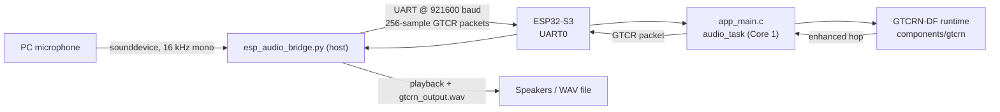
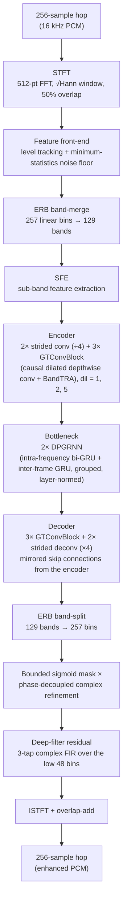

# Embedded GTCRN Runtime — ESP32-S3 On-Device Speech Enhancement

`embedded/` is the on-device inference component of the **SPASHTA** project
([bhavik4444/SPASHTA](https://github.com/bhavik4444/SPASHTA)). It is a
self-contained ESP-IDF project that runs a streaming speech-enhancement
(noise-suppression) neural network entirely on an ESP32-S3 — int8 weights
resident in flash, no cloud round-trip, no host-side inference — and ships a
small PC-side bridge script so the board can be exercised end-to-end with
nothing more than a USB cable and a microphone.

> **Model:** a from-scratch C reimplementation of **GTCRN**
> (Grouped Temporal Convolutional Recurrent Network — Rong et al.,
> *"GTCRN: A Speech Enhancement Model Requiring Ultralow Computational
> Resources,"* ICASSP 2024, [github.com/Xiaobin-Rong/gtcrn](https://github.com/Xiaobin-Rong/gtcrn)),
> extended here with a deep-filtering residual stage (the "DF" in the code's
> internal name **GTCRN-DF**) and quantised to int8 for microcontroller
> deployment. It is not a converted/exported graph — every layer is hand-written
> C driven by a small binary weight blob.

---

## 1. What it does

- Takes one **16 ms hop (256 samples @ 16 kHz)** of noisy PCM at a time and
  returns one hop of enhanced PCM, holding all recurrent/convolutional state
  internally — memory use is flat, an hour of audio costs the same RAM as one
  second.
- Runs with **int8 weights** for every matmul-shaped layer (convolutions,
  linear layers, GRU gates) and **float32** for the parts that are numerically
  sensitive (STFT, feature front-end, depthwise convolutions, mask, deep
  filter), so quality stays close to the floating-point reference while the
  model fits comfortably in flash and SRAM.
- Uses a **hand-written Xtensa SIMD kernel** (`gt_dot_i8_s3.S`) for the int8
  dot product that dominates runtime, processing 16 signed int8 multiply-
  accumulates per instruction on the ESP32-S3's 128-bit vector unit.
- Is purely **causal**: algorithmic latency is exactly one hop (16 ms), the
  model never looks ahead.
- Ships a **PC↔board demo** (`host/esp_audio_bridge.py`) that records from
  your computer's microphone, streams it to the board over UART in hops,
  plays back and saves the enhanced result — the fastest way to hear the
  model working without any extra hardware.

---

## 2. Repository layout

```text
embedded/
├── CMakeLists.txt              # top-level ESP-IDF project file
├── README.md                   # this file
├── dependencies.lock           # locked component versions (IDF 6.2.0, target esp32s3)
├── partitions.csv              # custom flash partition table
├── sdkconfig.defaults          # chip/board defaults (flash, PSRAM, clocks, watchdogs)
│
├── components/gtcrn/           # the GTCRN-DF inference engine, as its own IDF component
│   ├── CMakeLists.txt
│   ├── include/gtcrn.h         # public API consumed by main/
│   ├── gtcrn_internal.h        # blob layout, layer descriptors, private structs
│   ├── gtcrn_net.c             # blob loader, memory planner, frame-by-frame forward pass
│   ├── gtcrn_ops.c             # numeric kernels: conv, GRU, FFT, quantisation, activations
│   └── gt_dot_i8_s3.S          # hand-written Xtensa SIMD int8 dot-product kernel
│
├── main/                       # firmware application
│   ├── app_main.c              # entry point — current build: UART serial-bridge demo
│   ├── board_config.h          # every pin + firmware-mode switch, in one place
│   ├── audio_io.c / .h         # I2S mic + I2S speaker + SD card driver (built, not yet wired in)
│   ├── usb_audio.c / .h        # USB Audio Class host mic driver (built, not yet wired in)
│   ├── wav.c / .h              # streaming 16-bit PCM WAV reader/writer
│   ├── gtcrn_int8.bin          # exported, int8-quantised model weights (embedded into flash)
│   ├── gtcrn_int8.bin.json     # sidecar metadata for the model above
│   ├── idf_component.yml
│   └── CMakeLists.txt
│
├── host/
│   └── esp_audio_bridge.py     # PC companion: mic → UART → board → UART → speakers/WAV
│
└── docs/
    └── GTCRN_main_file_guide.md   # per-file development notes
```

`components/gtcrn` and `main` are two separate concerns: the former is a
portable, platform-agnostic DSP/NN library (it also builds and runs on a PC —
see `#ifdef ESP_PLATFORM` throughout `gtcrn_net.c`/`gtcrn_ops.c`); the latter
is the ESP32-S3 firmware that wraps it.

---

## 3. Implementation design

### 3.1 System view — how the demo is wired end to end



The board never touches a microphone or speaker directly in this build — the
host script is the audio I/O, and the ESP32-S3 is a pure inference
co-processor reached over a UART. Section 3.3 below explains why, and section
7 explains how to change that.

### 3.2 Model pipeline — one hop through GTCRN-DF



This is exactly the graph implemented in `gtcrn_net.c` (`gtcrn_encode_frame` →
`gtcrn_backend_inplace`), and it mirrors the published GTCRN architecture —
STFT → ERB analysis → sub-band feature extraction → grouped
conv/dilated-depthwise encoder with temporal recurrent attention → dual-path
grouped RNN bottleneck → mirrored decoder → ERB synthesis → complex mask —
with one addition: a short complex FIR ("deep filter") applied as a residual
over the low frequency bins after masking, which sharpens harmonic detail
that a magnitude/phase mask alone tends to smear.

### 3.3 Numerics and the ESP32-S3-specific kernel

| Layer type | Precision | Why |
|---|---|---|
| Convolutions, linear layers, GRU gates (matmul-shaped) | int8 weights, per-output-row scale; activations dynamically quantised per call | These layers dominate compute; int8 cuts flash footprint and lets the SIMD dot-product kernel run |
| Feature front-end, depthwise 3×3 conv, mask, deep filter, STFT/ISTFT | float32 | Numerically sensitive; kept exact |
| `gt_dot_i8` (the inner dot product behind every quantised layer) | int8×int8→int32, ESP32-S3 Xtensa PIE SIMD (`EE.VMULAS.S8.ACCX.LD.IP`, 16 MACs/instruction, fused with the next load) for `n ≥ 16`; scalar C fallback otherwise or on other targets | The single hottest routine in the runtime |

`tools/export_int8.py` and `tools/gtcrn_ref.py` (bit-level Python reference,
in the parent SPASHTA repo, not copied into this component) are the source of
truth for the exact quantisation scheme — `gtcrn_ops.c` calls out every place
where a naive port would silently lose a few dB (rounding at exactly 0.5, the
tap parity of the transposed convolution, GRU gate ordering, etc.).

### 3.4 Memory placement

| Allocator | What lives there | Why |
|---|---|---|
| `alloc_fast` → `MALLOC_CAP_INTERNAL` (falls back to PSRAM) | Weights and hot per-frame scratch buffers | The S3's cache is small; re-fetching ~150 kB of coefficients over the SPI bus every 16 ms frame is the easiest way to make inference 3× slower than it needs to be |
| `alloc_big` → `MALLOC_CAP_SPIRAM` (falls back to internal) | History ring buffers (level/noise-floor rings, GTConvBlock dilation history, deep-filter history) | Large, but touched lightly per frame, so PSRAM's extra latency doesn't matter |

`gtcrn_mem_internal()` / `gtcrn_mem_psram()` report the exact split at
runtime; `app_main.c` logs both on boot.

### 3.5 Two-core pipeline (advanced)

For throughput-critical use (continuous LIVE mode, see §7), the API is split
so the encoder and the bottleneck/decoder/mask/deep-filter stages can run on
different FreeRTOS cores, pipelined one hop apart:

```
gtcrn_encode_hop()    -> fills a gtcrn_frame_t   (run on Core 0, e.g. alongside I2S)
gtcrn_backend_frame()  -> consumes/produces it     (run on Core 1)
gtcrn_synthesize_hop() -> turns it back into PCM
```

`gtcrn_process_hop()` (used by the current serial-bridge firmware) is the
simple, single-call, single-core equivalent of all three.

---

## 4. Model specification

Read from `main/gtcrn_int8.bin.json`, the metadata sidecar for the weight
blob actually embedded in flash:

| Parameter | Value |
|---|---|
| Sample rate | 16000 Hz |
| FFT size (`n_fft`) | 512 |
| Hop length | 256 samples (16 ms) |
| Frequency bins (`n_freqs`) | 257 |
| ERB linear bins (`erb1`) | 65 |
| ERB compressed bands (`erb2`) | 64 |
| ERB width (`erb1 + erb2`) | 129 |
| Bottleneck width (`bn_width`) | 33 |
| Base channels | 16 |
| DPGRNN blocks | 2 |
| BandTRA groups (`tra_bands`) | 8 |
| GTConvBlocks / dilations | 3 → [1, 2, 5] |
| Deep-filter taps (`df_order`) | 3 |
| Deep-filter bins (`df_bins`) | 48 |
| Decoder head channels (`n_out`) | 9 (3 mask channels + 2 × 3 deep-filter taps) |
| Mask range | 0.0 – 2.0 (firmware floor overridden to **0.02**, ≈ −34 dB, via `gtcrn_set_mask_min`) |
| Spectral compression | 0.3 |
| Level-tracker window | 192 frames |
| Smoothing window | 4 frames |
| Noise-floor window | 96 frames |
| Training/target loudness (`mix_rms`) | 0.10 RMS |

Algorithmic latency = 1 hop = **16 ms** at 16 kHz, independent of stream
length (see `gtcrn_latency_samples()`).

---

## 5. What the firmware actually does today

`main/app_main.c` implements a single mode: a **binary UART serial bridge**,
used together with `host/esp_audio_bridge.py`. On boot it:

1. Initialises **UART0** at **921600 baud** (`TX = GPIO43`, `RX = GPIO44` —
   the usual USB-serial pins on ESP32-S3 dev boards).
2. Locates the `gtcrn_int8.bin` blob embedded in flash via the linker symbols
   `_binary_gtcrn_int8_bin_start` / `_end`, and calls `gtcrn_create()`.
3. Reads the model's own config back out (`gtcrn_config()`) and asserts it is
   16 kHz / hop-256, logs sample rate, FFT size, latency, and the
   internal/PSRAM memory split.
4. Sets the mask floor to `0.02` and calls `gtcrn_reset()`.
5. Spawns `audio_task`, pinned to **Core 1**, at priority 5 with a 16 KB
   stack.
6. Inside `audio_task`, after a 500 ms settle delay, it **disables all ESP_LOG
   output on UART0** — from that point on the port carries only binary audio,
   never text — and loops forever: read a packet header + 256-sample PCM hop,
   convert int16 → float, call `gtcrn_process_hop()`, convert back, write the
   result out as the same packet shape.

### Wire protocol

| Field | Type | Value |
|---|---|---|
| UART port | — | UART0 (921600 baud, 8N1, no flow control) |
| Packet magic | `uint32`, little-endian | `0x47544352` (ASCII `"GTCR"`) |
| Header | `struct { uint32 magic; uint16 samples; }` (packed) | 6 bytes |
| Payload | `int16[256]` | 512 bytes — one hop of PCM |
| Total packet | — | 518 bytes, **same shape both directions** |
| Direction | — | Host → board: raw noisy hop. Board → host: the same shape, GTCRN-enhanced |

If the magic doesn't match, the firmware discards one byte and resynchronises
rather than trying to process garbage — safe against a host that connects
mid-stream or a boot-log byte that slipped through.

**`audio_io.c`, `usb_audio.c`, and `wav.c` are compiled into this build but
are not called from `app_main.c` today.** They implement I2S microphone/
speaker I/O, SD-card mounting, USB Audio Class host input, and WAV file
read/write respectively, and `board_config.h` already defines three firmware
modes (`GTCRN_MODE_FILE` / `_RECORD` / `_LIVE`) for exactly this purpose —
they're just not wired into the current entry point, which uses the simpler
PC-tethered bridge instead. See §7 for how to connect them.

---

## 6. Getting started

### Prerequisites

- **ESP-IDF** — locked to **v6.2.0** for target **`esp32s3`** (see
  `dependencies.lock`); the ESP-IDF Component Manager will also pull in
  `espressif/usb_host_uac ^1.5.0` (and its own dependencies) automatically on
  first build.
- An ESP32-S3 board with **16 MB flash** and **8 MB PSRAM** (Octal by
  default — see the note in `sdkconfig.defaults` if your module has Quad
  PSRAM instead).
- USB cable + serial driver for your board.
- Python 3 with `pyserial`, `sounddevice`, and `numpy` for the host demo.

### Build and flash

```bash
cd embedded
idf.py set-target esp32s3
idf.py build
idf.py -p /dev/ttyUSB0 flash
```

Boot logs (before the audio task silences the port):

```bash
idf.py -p /dev/ttyUSB0 monitor
```

Exit monitor with `Ctrl+]`.

`gtcrn_int8.bin` is already committed under `main/` and is embedded
automatically by `main/CMakeLists.txt` — no extra export step is needed to
build and flash. It was produced upstream by `tools/export_int8.py` (in the
parent SPASHTA repo, not part of this component's files); re-run that
exporter there if you retrain or requantise the model.

**Optional boot self-test:** if a `main/gtcrn_testvec.bin` file is present
(not included in this component's copy) and `GTCRN_SELFTEST` is left at `1`
in `board_config.h`, the build additionally embeds the test vector and the
firmware compares its own output against a PC-computed reference on boot.
Generate a fresh vector with `quantization/verify_export.py` (also in the
parent repo) when you want this check.

---

## 7. Running the live demo

```bash
pip install pyserial sounddevice numpy
cd embedded/host
python esp_audio_bridge.py
```

With the board flashed and connected, the script:

1. Opens the serial port (`/dev/ttyUSB0` @ 921600 baud by default — edit
   `PORT` at the top of the script if yours differs, e.g. a Windows `COMx` or
   a different `/dev/tty*`) and waits ~4 s for the board to finish booting.
2. Records **20 s** of mono 16 kHz audio from your default input device.
3. Normalises the *whole recording* once to the model's training loudness
   (`TARGET_RMS = 0.10`, matching `mix_rms` above), clamping the applied gain
   to 0.25×–4.0× for safety, and saves the untouched original as
   `input.wav`.
4. Streams the normalised recording to the board **256 samples at a time**,
   using the exact packet format in §5, and reassembles the enhanced hops it
   gets back — GTCRN's recurrent state stays alive across all hops, exactly
   as it would in a continuous stream.
5. Undoes the input gain to restore the original loudness, applies a small
   headroom factor, clips, and saves `gtcrn_output.wav`.
6. Plays the enhanced audio back through your default output device.
7. Prints a **real-time ratio** (`elapsed / audio duration`) so you can see
   how the current `base_channels = 16` model's per-hop cost compares to the
   16 ms real-time budget — useful before attempting a continuous LIVE mode.

---

## 8. Hardware configuration (`board_config.h`)

All pins and firmware-mode switches live in this single file; nothing else
needs to change when wiring changes.

| Signal | Purpose | GPIO |
|---|---|---|
| `MIC_BCLK_GPIO` | I2S mic bit clock | 4 |
| `MIC_WS_GPIO` | I2S mic word select | 5 |
| `MIC_DIN_GPIO` | I2S mic data in | 6 |
| `SPK_BCLK_GPIO` | I2S speaker bit clock | 15 |
| `SPK_WS_GPIO` | I2S speaker word select | 16 |
| `SPK_DOUT_GPIO` | I2S speaker data out | 7 |
| `SD_MOSI_GPIO` / `SD_MISO_GPIO` / `SD_SCLK_GPIO` / `SD_CS_GPIO` | SD card over SPI (`SPI2_HOST`, 20 MHz) | 11 / 13 / 12 / 10 |

The I2S mic reader shifts incoming 32-bit slots right by **11 bits**, not 16
— MEMS parts like the INMP441/ICS-43434/SPH0645 put 24 significant bits at
the top of the frame, and shifting by 16 would throw away 8 bits of headroom.
`OUTPUT_GAIN` (default `1.0`) is applied after enhancement to compensate for
the model's fixed training loudness before writing final 16-bit PCM.

### Firmware modes (defined, not yet wired into `app_main.c`)

| Mode | Behaviour |
|---|---|
| `GTCRN_MODE_FILE` | Read `/sdcard/noisy.wav`, enhance, write `/sdcard/clean.wav`. Fully deterministic, no microphone needed — the best place to start when bringing up new hardware, since you can diff the board's output against a PC run sample-for-sample. |
| `GTCRN_MODE_RECORD` (documented default) | Capture `RECORD_SECONDS` (20 s) from the mic into PSRAM, then enhance the whole buffer and write `/sdcard/clean.wav`. Separates capture from processing rather than pretending to keep up in real time. |
| `GTCRN_MODE_LIVE` | Continuous mic → enhance → I2S out. Only keeps up if per-hop inference cost is under the 16 ms budget — use the two-core pipeline (§3.5) and check `gtcrn_last_frame_us()` before relying on this. |

### Chip / build configuration (`sdkconfig.defaults`, `partitions.csv`)

| Setting | Value |
|---|---|
| Target | `esp32s3` |
| Flash | 16 MB, QIO mode, 80 MHz |
| PSRAM | 8 MB, **Octal**, 80 MHz (switch `SPIRAM_MODE_OCT` → `SPIRAM_MODE_QUAD` for N8R2/N8R8-class modules) |
| CPU clock | 240 MHz, both cores |
| FreeRTOS tick | 1000 Hz |
| Task watchdog | 30 s task timeout, 1000 ms interrupt timeout (relaxed because enhancement can occupy a core for a while) |
| Partition table | custom: `nvs` 24 KB, `phy_init` 4 KB, `factory` app 4 MB — **no OTA slot**, so updates are full reflashes unless the table is revised |

---

## 9. Extending toward standalone (no-PC) operation

Everything needed for a fully on-device pipeline is already compiled in —
it just isn't called yet:

1. Branch `app_main.c` on `GTCRN_MODE` (from `board_config.h`).
2. For `GTCRN_MODE_FILE`/`RECORD`: call `sd_mount()`, then
   `wav_read_open()`/`wav_read()` or `mic_init()`/`mic_read()` to fill a
   buffer, feed it to `gtcrn_process_hop()` one 256-sample hop at a time (as
   `audio_task` already does over UART), and write results with
   `wav_write()`/`spk_write()`.
3. For `GTCRN_MODE_LIVE`, throughput becomes the constraint: the model must
   sustain one hop (16 ms) of work per hop *received*. Use the two-core split
   from §3.5 — `gtcrn_encode_hop()` alongside I2S handling on Core 0,
   `gtcrn_backend_frame()`/`gtcrn_synthesize_hop()` on Core 1 — and measure
   headroom with `gtcrn_last_frame_us()` before trusting it not to drop
   audio.
4. Swap `mic_read()` for `usb_audio_read()` (see `usb_audio.h`, 48 kHz mono
   16-bit) if the input is a USB microphone instead of an I2S one; it will
   need resampling to 16 kHz before `gtcrn_process_hop()`.

---

## 10. Known limitations

- `app_main.c` currently wires **only** the UART serial-bridge path; the
  I2S/SD/USB-microphone modules are built but dormant (§9 covers wiring them
  up).
- No OTA partition — firmware updates are full reflashes over USB.
- `docs/GTCRN_main_file_guide.md` references a `wifi_audio.c/.h` module and
  two legacy `app_main_*.c` snapshots from earlier development; none of these
  are part of this component's current file set.
- The model-export and verification tools it depends on
  (`tools/export_int8.py`, `tools/gtcrn_ref.py`, `quantization/verify_export.py`)
  live in the parent SPASHTA repository, not inside `embedded/`.
- A `gtcrn_t` handle is **not re-entrant** — one instance per audio stream,
  used from a single task.

---

## 11. Credits

- **GTCRN architecture:** Xiaobin Rong, Tianchi Sun, Xu Zhang, Yuxiang Hu,
  Changbao Zhu, Jing Lu — *"GTCRN: A Speech Enhancement Model Requiring
  Ultralow Computational Resources,"* ICASSP 2024.
  [github.com/Xiaobin-Rong/gtcrn](https://github.com/Xiaobin-Rong/gtcrn)
- This component's C runtime, int8 quantisation, deep-filter extension, and
  ESP32-S3 SIMD kernel are an independent reimplementation for microcontroller
  deployment, written for the **SPASHTA** project:
  [github.com/bhavik4444/SPASHTA](https://github.com/bhavik4444/SPASHTA)